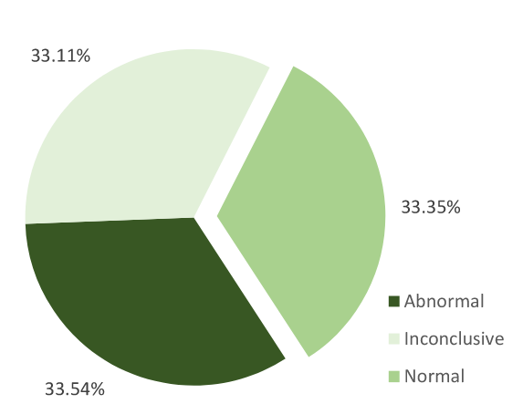
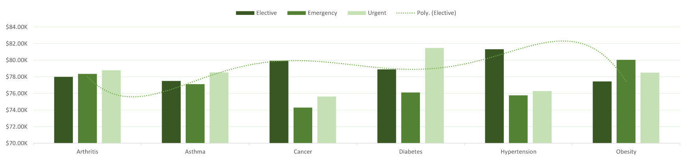
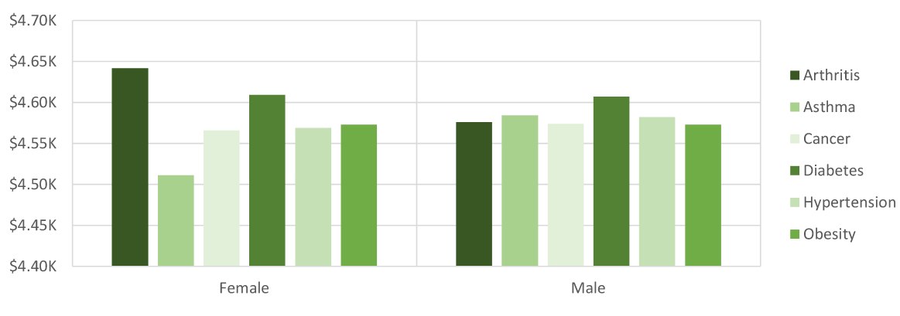
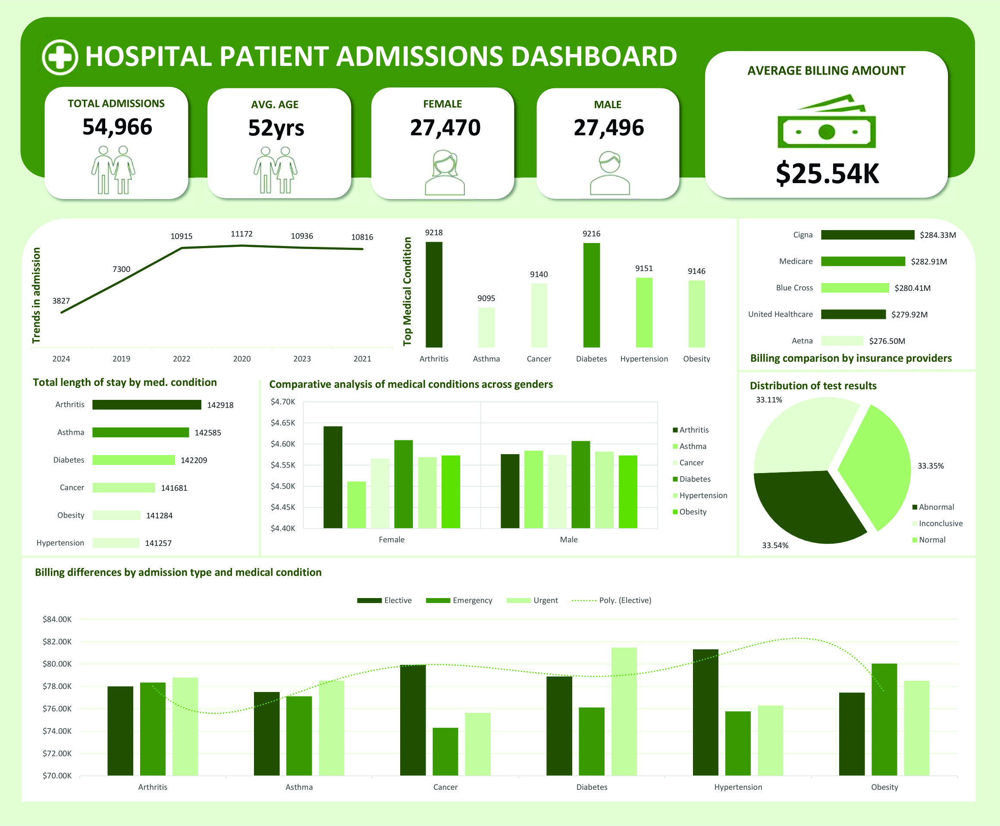

# 🏥 CheckIn‑CheckUp  
*By Ashutosh Singhania*  
*July 2025*

---

## 🔗 Table of Contents
1. [Project Description](#project-description)  
2. [Data Source](#data-source)   
3. [Usage](#usage)  
4. [Key Findings](#key-findings)  
5. [Visualizations](#visualizations)  
6. [Recommendations](#recommendations)  
7. [Folder Structure](#folder-structure)  
8. [Future Work](#future-work)  
9. [License](#license)

---

## 1. Project Description  
**CheckIn‑CheckUp** is an exploratory data analysis project that examines hospital patient admissions. The goal is to identify trends and insights across demographics, admission types, medical conditions, and billing patterns. The project helps stakeholders make data-informed decisions for improving hospital operations and patient care.

---

## 2. Data Source  
This project uses an anonymized hospital admissions dataset that includes:
- Patient demographics (age, gender)  
- Admission records (type, dates)  
- Medical conditions  
- Test results  
- Billing amounts  
- Insurance provider  

> *Note: This dataset was provided as part of a portfolio project and may be synthetic for academic use.*

---


---

## 3. Usage  
1. Open the notebook in Jupyter.  
2. Load the dataset.  
3. Follow steps to clean the data, engineer features like Length of Stay, and visualize trends.  
4. Review insights, and view the output images or dashboard.

---

## 4. Key Findings  
- ✅ **Balanced Demographics**: Male and female patients are almost equally represented.  
- 🩺 **Top Medical Conditions**: Hypertension, Obesity, and Diabetes.  
- 🧪 **Test Result Split**: Normal (33.35%), Abnormal (33.54%), Inconclusive (33.11%)  
- 🏥 **Admissions**: Emergency admissions are costliest, arthritis & asthma lead to longer stays.  
- 💰 **Billing Insights**: Cigna, Medicare, and Blue Cross are top contributors in high billing amounts.  
- 📊 **Stable Trends**: Hospital admissions were steady throughout 2021–2022.

---

## 5. Visualizations  

### 🩺 Top Medical Conditions  


### 🧪 Test Result Distribution  


### 📈 Admission Trends  


### 🕒 Length of Stay by Condition  


### 💵 Billing Comparison  


### 🧾 Billing by Condition  


### 📊 Comparative Analysis  


### 📊 Final Dashboard  


---

## 6. Recommendations  
- Focus early detection on high-stay conditions (e.g., Arthritis, Asthma)  
- Prepare hospital resources in advance based on seasonal trends  
- Educate patients to reduce emergency admissions  
- Renegotiate insurance plans based on high billing trends (esp. with Cigna)

---

## 7. Folder Structure
```
CheckIn-CheckUp/
├── CheckIn-CheckUp.ipynb
├── Healthcare Project.xlsx
├── Billingcomparison.png
├── Billingdifference.png
├── Comparativeanalysis.png
├── Distributionoftestresult.png
├── Healthcareprojectdashboard.jpg
├── Lengthofstay.png
├── Topmedicalcondition.png
├── Trendsinadmission.png
├── README.md
└── requirements.txt
```

---

## 8. Future Work  
- Build predictive models for readmission risk or billing amount  
- Use Streamlit to deploy an interactive dashboard  
- Integrate more real-world hospital datasets

---


